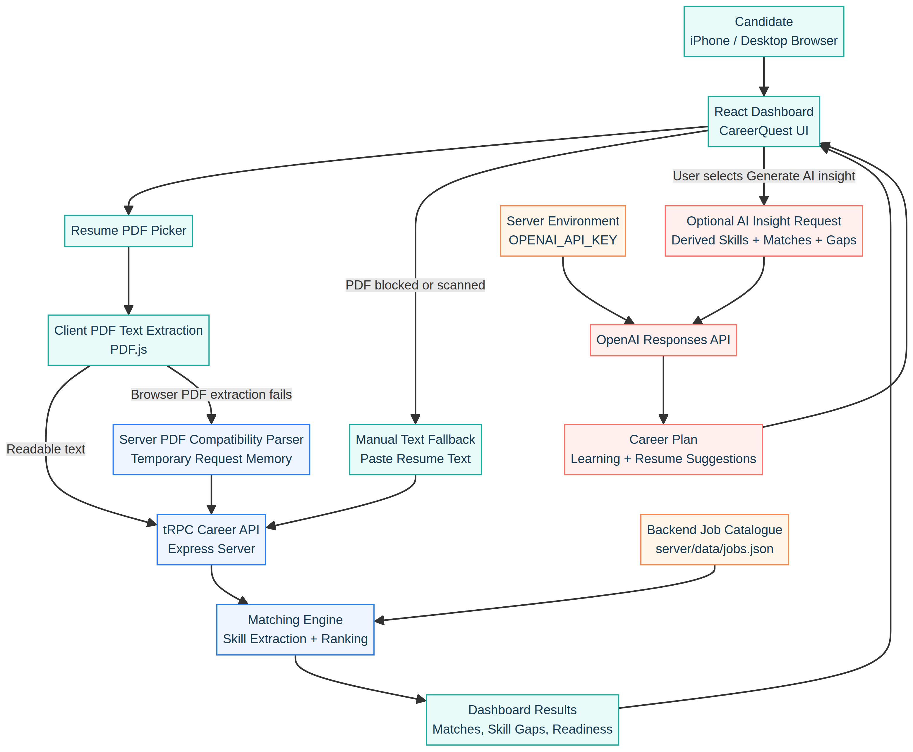

# CareerQuest Application Workflow

**Version:** 1.1  
**Purpose:** Explain how CareerQuest accepts a résumé, ranks relevant roles, displays career guidance and tutorials, and handles iPhone recovery paths.

## 1. System Overview

CareerQuest is a React-based career-matching dashboard. A candidate supplies a résumé as a PDF or, where mobile browser limitations prevent PDF extraction, pastes résumé text. The application identifies skills, compares them with the server-managed jobs catalogue, ranks the most relevant roles, and presents skill gaps and readiness indicators.

The AI career coach is optional. It runs only when the candidate selects **Generate AI insight** and receives a derived analysis summary, rather than the uploaded PDF itself. The API key remains in the server environment and is never exposed to the browser.

## 2. Block Diagram

The diagram separates the browser experience, temporary server processing, backend job data, and optional AI service. It also shows the recovery path used when iPhone or in-app browser PDF handling is unreliable.

## 3. Primary Processing Flow

| Step | Component | Activity | Output |
|---:|---|---|---|
| 1 | Candidate browser | The candidate selects a résumé PDF. | PDF file selected in the browser. |
| 2 | React dashboard | The dashboard tries to extract selectable résumé text in the browser. | Text for matching, when browser extraction succeeds. |
| 3 | Compatibility fallback | If browser extraction fails, the PDF is passed to a temporary server-side parser. If file access is blocked, the candidate can paste résumé text instead. | Usable résumé text, or a clear recovery route. |
| 4 | tRPC Career API | The client sends transient résumé text to the career-analysis procedure. | Analysis request. |
| 5 | Matching engine | Skills are normalized, compared with the job catalogue, and scored using role requirements and role affinity. | Ranked role matches, matched skills, missing skills, and readiness metrics. |
| 6 | React dashboard | CareerQuest renders the leaderboard, skill gaps, readiness signals, and suggested improvement areas. | Candidate-facing career dashboard. |

## 4. Mobile and iPhone Recovery Flow

The standard route relies on browser PDF capabilities. Some iPhone in-app browsers can restrict file handoff or PDF-worker execution before the file reaches the normal client parser. CareerQuest therefore includes two recovery mechanisms.

| Scenario | Recovery mechanism | Candidate action |
|---|---|---|
| The iPhone browser cannot extract PDF text | Temporary server-side PDF parser | Wait for CareerQuest to retry automatically after client parsing fails. |
| WhatsApp or another in-app browser blocks PDF handling before retry | Manual résumé-text fallback | Select **PDF blocked on iPhone? Paste text**, paste the profile, skills, and experience sections, then select **Analyze pasted resume**. |
| Résumé is scanned or image-only | Text-based recovery | Use the paste-text fallback or export a searchable PDF before retrying. |

## 5. Optional AI Insight and Tutorial Flow

The AI experience is isolated from the core matching workflow. Selecting **Generate AI insight** sends the detected skills, leading job matches, and recurring skill gaps to the server. The server uses `OPENAI_API_KEY` to call OpenAI’s Responses API and asks for a structured career plan containing a headline, learning priorities, résumé suggestions, certifications, and a 90-day application and improvement plan.

The server maps the resulting skill themes to up to three curated, public YouTube learning playlists. The dashboard embeds these tutorial playlists using YouTube’s privacy-enhanced iframe domain with inline-playback enabled for iPhone browsers.[1] The browser does not receive the OpenAI API key. Candidates who do not use the AI button still receive the complete matching, skill-gap, and readiness experience.

## 6. Data Handling Summary

| Data item | Location during processing | Persistent in CareerQuest? |
|---|---|---|
| Résumé PDF | Browser; temporary server request memory only if compatibility parsing is needed. | No. |
| Extracted or pasted résumé text | Browser and temporary matching request. | No. |
| Match results | React session state for the active page. | No. |
| Job descriptions | Backend source file: `server/data/jobs.json`. | Yes. |
| OpenAI API key | Server environment variable only. | Managed outside browser code. |
| AI insight context | Temporary server request sent only after the candidate requests an AI insight. | Not retained by CareerQuest. |
| Tutorial embed | Browser connects directly to a curated YouTube playlist. | No résumé data is passed in the playlist URL. |

For the project’s detailed data-handling position, see [`DATA_HANDLING.md`](../DATA_HANDLING.md). For iPhone-specific troubleshooting, see [`MOBILE_TROUBLESHOOTING.md`](../MOBILE_TROUBLESHOOTING.md).

## 7. Key Design Decisions

> **Temporary by default:** CareerQuest does not create a résumé-history table or write résumé files to its own file storage.

> **Jobs are backend managed:** Candidates upload only their résumé. The roles and requirements remain in the server-side JSON catalogue.

> **AI is explicit:** No AI request is made until the candidate selects the AI insight control.

> **Mobile recovery is built in:** A manual text option avoids dependence on PDF capabilities that may be blocked by iPhone in-app browsers.

> **Tutorials are curated:** The AI plan maps to public playlist IDs instead of sending candidate data to YouTube search.

## References

[1] [Google Developers, “YouTube Embedded Players and Player Parameters”](https://developers.google.com/youtube/player_parameters)
